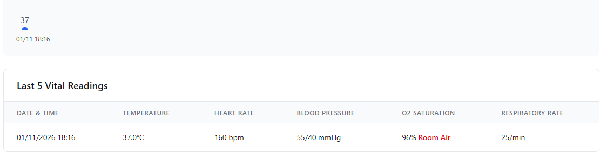

# Age-Based Vital Signs Reference Ranges

## Overview

The hacCare system now supports **age-appropriate vital signs assessment** with clinically accurate reference ranges for seven age categories from newborns to adults. This ensures proper evaluation of vital signs across all patient age groups used in clinical simulations.

## Age Bands

| Age Band | Age Range | Age Display |
|----------|-----------|-------------|
| NEWBORN | 0-28 days | "X days old" |
| INFANT | 1-12 months | "X months old" |
| TODDLER | 1-3 years | "X years old" |
| PRESCHOOL | 3-5 years | "X years old" |
| SCHOOL_AGE | 6-12 years | "X years old" |
| ADOLESCENT | 13-18 years | "X years old" |
| ADULT | 18+ years | "X years old" |

## Reference Ranges by Age Band

### Temperature (°C)

| Age Band | Normal Range (Green) | Abnormal Range (Yellow) | Critical Range (Red) |
|----------|----------------------|-------------------------|----------------------|
| Newborn | 36.5-37.5 | 36.0-36.4, 37.6-38.0 | <36.0, >38.0 |
| Infant | 36.5-37.5 | 36.0-36.4, 37.6-38.5 | <36.0, >38.5 |
| Toddler | 36.5-37.5 | 36.0-36.4, 37.6-39.0 | <36.0, >39.0 |
| Preschool | 36.5-37.5 | 36.0-36.4, 37.6-39.5 | <36.0, >39.5 |
| School Age | 36.5-37.5 | 36.0-36.4, 37.6-39.5 | <36.0, >39.5 |
| Adolescent | 36.1-37.2 | 35.5-36.0, 37.3-39.5 | <35.5, >39.5 |
| Adult | 36.1-37.2 | 35.0-36.0, 37.3-40.0 | <35.0, >40.0 |



### Additional Vital Sign Calculations

#### Mean Arterial Pressure (MAP)

MAP represents average blood pressure during one cardiac cycle and is critical for assessing organ perfusion.

**Formula:**
```
MAP = (Systolic + 2 × Diastolic) / 3
```

**Normal Ranges by Age:**
- **Newborn:** 40-60 mmHg
- **Infant:** 45-65 mmHg
- **Toddler:** 50-70 mmHg
- **Preschool:** 55-75 mmHg
- **School Age:** 60-80 mmHg
- **Adolescent/Adult:** 65-110 mmHg (target >65 for perfusion)

**Clinical Significance:**
- MAP <65 mmHg (adults) → Risk of inadequate organ perfusion
- MAP >110 mmHg → Risk of vascular damage
- More reliable than systolic alone for perfusion assessment

**Implementation Example:**
```typescript
function calculateMAP(systolic: number, diastolic: number): number {
  return Math.round((systolic + 2 * diastolic) / 3);
}

// Usage
const map = calculateMAP(120, 80); // Returns: 93 mmHg
```

#### Pulse Pressure

Difference between systolic and diastolic pressure, indicates arterial compliance.

**Formula:**
```
Pulse Pressure = Systolic - Diastolic
```

**Normal Range:** 30-50 mmHg (all ages)

**Clinical Significance:**
- Narrow (<25 mmHg) → Shock, aortic stenosis, heart failure
- Wide (>60 mmHg) → Aortic regurgitation, hyperthyroidism, arterial stiffness

## Usage

### Automatic Age Detection

The system automatically calculates the patient's age from their date of birth and applies appropriate reference ranges:

```typescript
import { calculatePreciseAge, getVitalRangesForPatient } from '@/utils/vitalRanges';

// Get patient age with precision (days/months/years)
const age = calculatePreciseAge('2024-01-15'); // Returns PatientAge object

console.log(age.displayString); // "3 days old" or "8 months old" or "5 years old"
console.log(age.ageBand); // "NEWBORN" or "INFANT" etc.

// Get age-appropriate vital ranges
const ranges = getVitalRangesForPatient('2024-01-15');

console.log(ranges.ageDescription); // "Newborn (0-28 days)"
console.log(ranges.heartRate); // { min: 120, max: 160, criticalLow: 100, criticalHigh: 180, unit: 'BPM' }
```

### Assessing Vital Signs

```typescript
import { assessVitalSign } from '@/utils/vitalRanges';

// Assess a vital sign value against age-appropriate ranges
const assessment = assessVitalSign('heartRate', 130, '2024-01-15');

console.log(assessment.status); // 'normal' | 'abnormal' | 'critical'
console.log(assessment.message); // "Normal" or "Below Normal" or "Critically High"
console.log(assessment.color); // CSS class: 'text-green-600' | 'text-yellow-600' | 'text-red-600'
console.log(assessment.bgColor); // CSS class: 'bg-green-50' | 'bg-yellow-50' | 'bg-red-50'
```

### In React Components

The `VitalSignsField` component automatically uses age-based ranges when `patientDateOfBirth` is provided:

```tsx
<VitalSignsField
  field={field}
  value={vitals}
  onChange={handleChange}
  patientDateOfBirth={patient.date_of_birth} // Enable age-based ranges
/>
```

**Features:**
- Shows age band in header (e.g., "Infant (1-12 months)")
- Color-coded status indicators adapt to patient age
- Hover hints show age-appropriate normal ranges
- Visual alerts for abnormal/critical values

### Backward Compatibility

If no date of birth is provided, the system defaults to adult ranges:

```tsx
// Without date of birth - uses adult ranges
<VitalSignsField
  field={field}
  value={vitals}
  onChange={handleChange}
/>
```

```typescript
// Legacy function still works
import { getVitalStatus } from '@/utils/patientUtils';

// Without DOB - uses adult ranges
const status = getVitalStatus('heartRate', 75);

// With DOB - uses age-appropriate ranges
const status = getVitalStatus('heartRate', 130, '2024-01-15');
```

## Visual Indicators

### Status Colors

- **Green** (Normal): Value within normal range for age
- **Yellow** (Abnormal): Value outside normal but not critical
- **Red** (Critical): Value in dangerous range requiring immediate attention

### Example Display

```
┌─────────────────────────────────────────────────────┐
│ Vital Signs              Infant (1-12 months)      │
├─────────────────────────────────────────────────────┤
│ 🌡️ Temperature: 37.2°C                    ✓ Normal │
│    Normal: 36.5-37.5°C                              │
│                                                     │
│ ❤️ Heart Rate: 135 BPM                    ✓ Normal │
│    Normal: 100-150 BPM                              │
│                                                     │
│ 🫁 Respiratory Rate: 32/min               ✓ Normal │
│    Normal: 25-50 /min                               │
└─────────────────────────────────────────────────────┘
```

## Clinical Scenarios

### Scenario 1: Newborn with Normal Vitals

```
Patient: Baby Girl Smith (3 days old)
- Heart Rate: 145 BPM → ✓ Normal (Range: 120-160)
- Temperature: 37.0°C → ✓ Normal (Range: 36.5-37.5)
- Respiratory Rate: 45/min → ✓ Normal (Range: 30-60)
```

### Scenario 2: Toddler with Fever

```
Patient: Emma Johnson (2 years old)
- Temperature: 38.8°C → ⚠️ Abnormal (Range: 36.5-37.5)
- Heart Rate: 125 BPM → ✓ Normal (Range: 90-140)
- Status: Yellow alert - fever present but not critical
```

### Scenario 3: School-Age Child with Bradycardia

```
Patient: Michael Davis (9 years old)
- Heart Rate: 52 BPM → 🚨 Critical (Range: 70-110, Critical: <55)
- Blood Pressure: 95/55 → ✓ Normal (Range: 90-120/50-80)
- Status: Red alert - heart rate critically low
```

## Benefits

1. **Clinical Accuracy**: Proper assessment of pediatric patients using age-appropriate norms
2. **Educational Value**: Students learn normal ranges vary by age
3. **Safety**: Prevents false alarms from using adult ranges on children
4. **Flexibility**: Supports simulations across all age groups
5. **Backward Compatible**: Existing code continues to work without modifications

## Technical Implementation

### Core Files

- **`src/utils/vitalRanges.ts`**: Main utility module with all age-based logic
- **`src/utils/patientUtils.ts`**: Enhanced with age band classification
- **`src/components/forms/fields/VitalSignsField.tsx`**: Age-aware UI component

### Key Functions

- `calculatePreciseAge()`: Calculate age with days/months/years precision
- `getVitalRangesForPatient()`: Get age-appropriate ranges from DOB
- `assessVitalSign()`: Evaluate vital sign against age-appropriate ranges
- `formatVitalRange()`: Format range for display

### Type Safety

All functions are fully typed with TypeScript interfaces:

```typescript
type AgeBand = 'NEWBORN' | 'INFANT' | 'TODDLER' | 'PRESCHOOL' | 'SCHOOL_AGE' | 'ADOLESCENT' | 'ADULT';

interface PatientAge {
  years: number;
  months: number;
  days: number;
  totalDays: number;
  ageBand: AgeBand;
  displayString: string;
}

interface VitalRange {
  min: number;
  max: number;
  criticalLow: number;
  criticalHigh: number;
  unit: string;
}

interface AgeBandVitalRanges {
  ageBand: AgeBand;
  ageDescription: string;
  temperature: VitalRange;
  heartRate: VitalRange;
  systolic: VitalRange;
  diastolic: VitalRange;
  respiratoryRate: VitalRange;
  oxygenSaturation: VitalRange;
}
```

## Future Enhancements

Potential future improvements:

1. **Pain Assessment (6th Vital Sign)**: Add age-appropriate pain scales
   - FLACC Scale (Face, Legs, Activity, Cry, Consolability) for ages 0-3
   - Wong-Baker FACES Pain Rating Scale for ages 3-7
   - Numeric Rating Scale (0-10) for ages 8+
   - Visual Analog Scale (VAS) for adolescents/adults
   - CPOT/BPS scales for non-verbal or sedated patients

2. **Database Storage**: Move reference ranges to database for configurability

3. **Custom Ranges**: Allow institutions to define their own reference values

4. **Alert Thresholds**: Integrate with alert system for automated notifications

5. **Trending Analysis**: Compare current vs. historical vitals with age context

6. **Additional Age Bands**: Support geriatric ranges (65+, 75+, 85+)

7. **Condition-Specific Ranges**: Adjust ranges for specific diagnoses

8. **Blood Glucose Monitoring**: Add age-appropriate glucose reference ranges
   - Newborn: 45-90 mg/dL (first 24 hours)
   - Infant/Child: 70-100 mg/dL (fasting)
   - Adolescent/Adult: 70-100 mg/dL (fasting), <140 mg/dL (post-meal)

9. **Level of Consciousness Assessment**: Integrate Glasgow Coma Scale or AVPU tracking

10. **Automated MAP/Pulse Pressure Calculation**: Calculate and display derived metrics automatically

## References

This implementation is based on:
- American Heart Association pediatric guidelines
- American Academy of Pediatrics vital signs standards
- Pediatric Advanced Life Support (PALS) protocols
- Standard nursing textbooks for pediatric assessment

## Migration Guide

For existing components using vital signs:

### Before (Adult-only)

```typescript
const status = getVitalStatus('heartRate', patient.vitals.heartRate);
```

### After (Age-aware)

```typescript
const status = getVitalStatus('heartRate', patient.vitals.heartRate, patient.date_of_birth);
```

**Note**: The old function signature still works - if you don't provide date of birth, it uses adult ranges for backward compatibility.

---

**Last Updated**: January 12, 2026  
**Version**: 5.3.0
